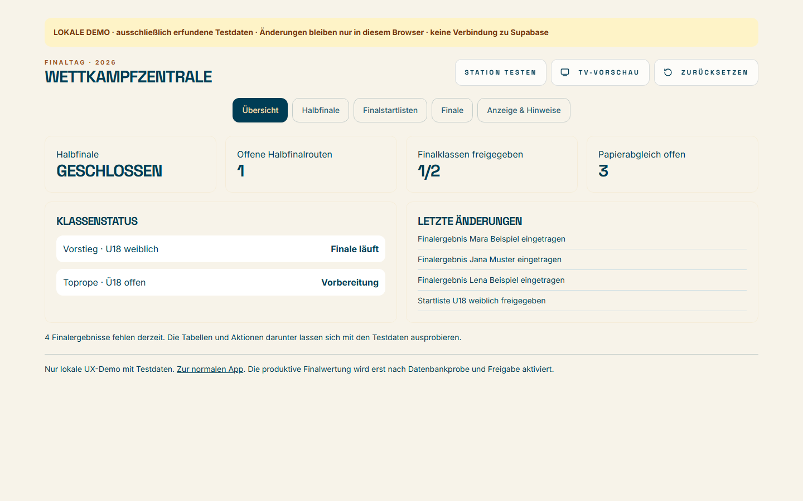
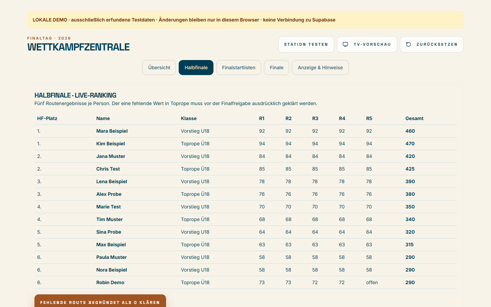
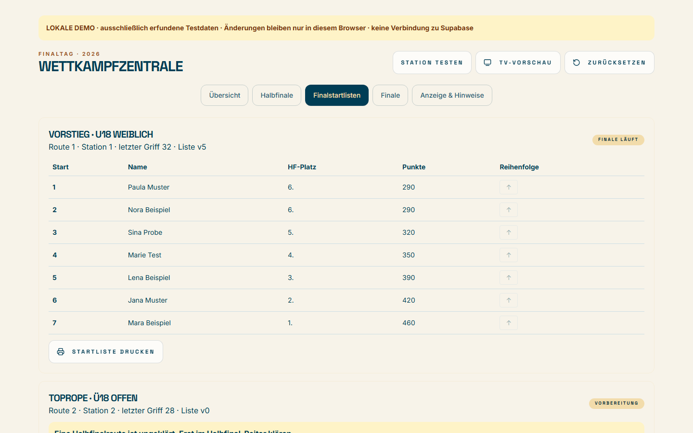
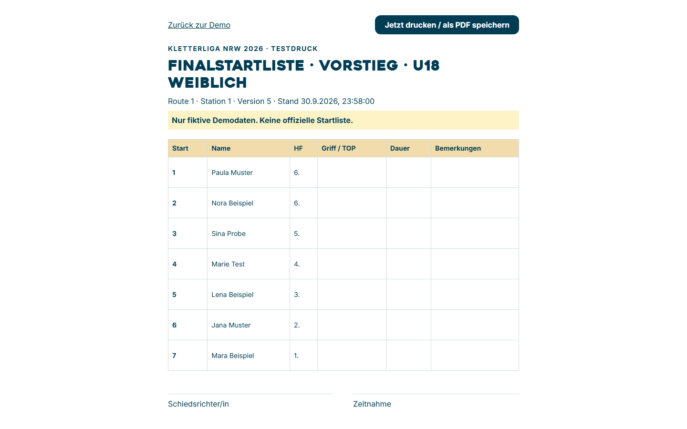
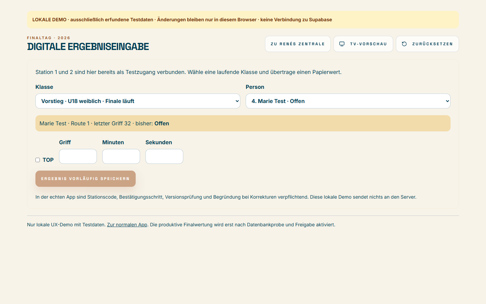
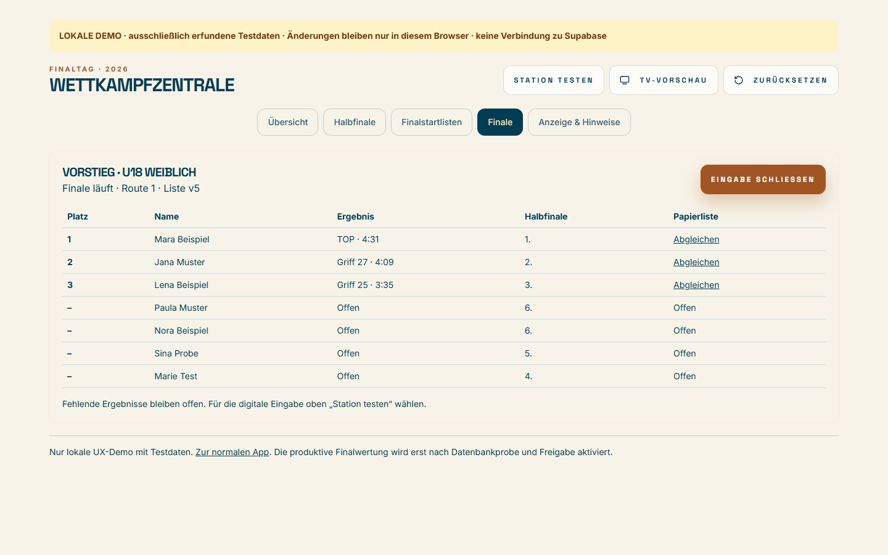
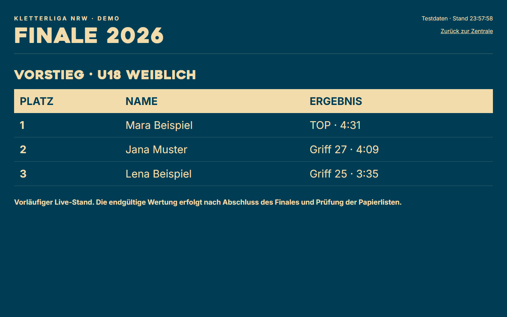

# Finaltag 2026 · Kurzanleitung mit Testdaten

**Für René und die Zeitnahme.** Diese Bilder zeigen eine **interaktive lokale Demo mit erfundenen Personen**. Sie ist unter [http://127.0.0.1:5337/demo/finaltag](http://127.0.0.1:5337/demo/finaltag) erreichbar, solange der lokale Vite-Server läuft. Änderungen bleiben in diesem Browser; **Zurücksetzen** stellt den Ausgangsstand wieder her. Die Demo verbindet sich nicht mit Supabase und ist keine offizielle Wettkampfoberfläche.

## 1. René kontrolliert die Übersicht

Die Übersicht zeigt offene Halbfinalrouten, freigegebene Klassen, Papierabgleich und die letzten Änderungen. Im Ausgangsstand läuft **Vorstieg U18 weiblich**, während **Toprope Ü18 offen** noch eine ungeklärte Halbfinalroute hat.

## 2. Fehlenden Halbfinalwert klären, Finalfeld freigeben

Unter **Halbfinale** ist Robin Demos fünfte Route zunächst **offen**. Mit **Fehlende Route begründet als 0 klären** wird sie ausdrücklich als nicht geklettert dokumentiert. Erst danach lässt sich unter **Finalstartlisten** das Toprope-Finalfeld bestätigen. Die sieben Personen in Vorstieg zeigen die Regel **sechs Plätze plus Punktgleiche an der Grenze**. Die Startfolge steht vom schlechtesten qualifizierten Halbfinalplatz zum besten.

**Startliste drucken** öffnet eine eigene A4-Ansicht. Dort **Jetzt drucken / als PDF speichern** wählen. Route, Station und Version vergleichen; bei einer neuen Version den alten Ausdruck ersetzen.

## 3. Zeitnahme trägt vom Papier digital ein

Oben **Station testen** wählen. Klasse und Person aus der Startliste auswählen, **Griff oder TOP** und **Minuten/Sekunden** vom Papier übertragen, dann **Ergebnis vorläufig speichern**. In der Demo ist Marie Test vorbereitet. Als Übungswert kann man **Griff 24 · 3:12** eintragen. Danach unter **Finale** prüfen, ob Marie im Ranking erscheint.

## 4. Papierabgleich und TV

Unter **Finale** jeden gespeicherten Wert mit der Papierliste vergleichen und **Abgleichen** wählen. Fehlende Werte bleiben offen. **Endgültig freigeben** ist erst möglich, wenn alle Ergebnisse vorliegen und abgeglichen sind. Unter **Anzeige & Hinweise** lassen sich TV-Phase und ein Testhinweis ändern. **TV-Vorschau** zeigt den vorläufigen Stand; in der Halbfinal-Phase zeigt sie Halbfinalpunkte.

**Für den echten Eventbetrieb:** René meldet sich mit seinem Liga-Admin-Konto unter `/app/admin/league/wettkampf` an; die Zeitnahme nutzt `/app/schiedsrichter/finale`, der Fernseher `/live/2026`. Die echte App erfordert Supabase-Anbindung, Finalmigration, getrennte Stationszugänge und die Generalprobe. Bei Netzausfall gelten die Papierlisten; eine nicht bestätigte digitale Eingabe ist nicht veröffentlicht. Die ausführliche Ablaufbeschreibung steht in [finale-wettkampfzentrale-2026.md](finale-wettkampfzentrale-2026.md).
