# Finaltag · Kurzanleitung für René und die Zeitnahme

Die Bilder zeigen die überarbeiteten **App-Oberflächen mit erfundenen Testdaten**. [Lokal ausprobieren](http://127.0.0.1:5337/demo/finaltag), solange der Entwicklungsserver läuft. Die Testdaten bleiben im Browser. **Testdaten zurücksetzen** stellt drei Klassen wieder her: Vorstieg U18 hat eine freigegebene Startliste, Vorstieg Ü18 läuft bereits und Toprope hat eine offene Halbfinalroute.

## 1. Über die Übersicht einsteigen

Unter **So geht es weiter** steht für jede Klasse der aktuelle Status, die nächste Aufgabe und deren Erklärung. **Klasse öffnen** führt direkt zur passenden Ansicht. Im Halbfinale stehen Suche und Klassenfilter direkt über der Liste. In Finalstartlisten und Finale lässt sich oben die **Klasse bearbeiten** wechseln. Der Fernseher läuft unabhängig davon.

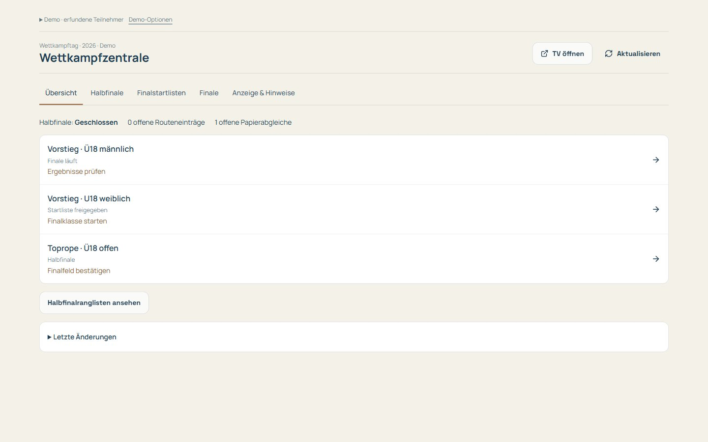

## 2. Halbfinale verfolgen und Startliste drucken

Schiedsrichter kontrollieren das Ergebnis und zeigen den Routen-QR. Nach Scan und **Ergebnis absenden** zählt der bestätigte Eintrag sofort. René sieht unter **Halbfinale** eine Rangliste mit Suche, Klassenfilter und **Offene Ergebnisse**. Ein Klick auf den Namen öffnet die fünf Routen. Für eine Korrektur **Ändern**, für einen fehlenden Wert **Eintragen** wählen; Griff und Begründung eingeben, dann **Speichern**. Das funktioniert während der offenen Eingabe und nach 16 Uhr. Er bestätigt diese Ergebnisse nicht erneut. **0 Punkte** ist ein eingetragenes Ergebnis, **Noch nicht eingetragen** bleibt offen. Teilnehmer prüfen ihre eigenen Einträge.

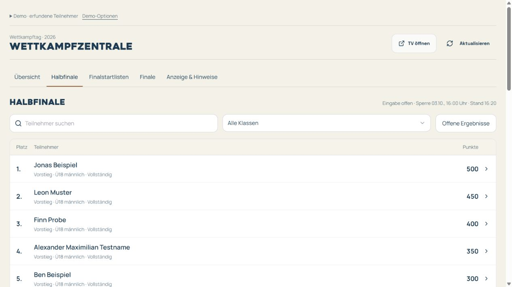

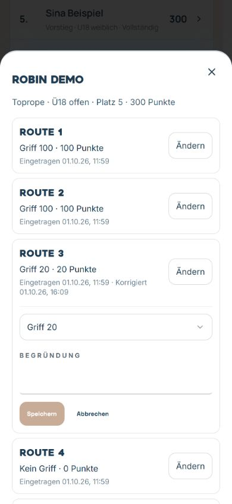

Am **3. Oktober 2026 um 16:00 Uhr** sperrt die normale Abgabe automatisch. René kann anschließend weiterhin im Teilnehmerdialog mit Begründung nachtragen oder ausdrücklich als nicht geklettert mit null Punkten klären. Unter **Demo-Optionen** startet **Halbfinale ausprobieren** diesen Ablauf neu. **16-Uhr-Sperre testen** simuliert das Fristende; Robins fünfte Toprope-Route ist offen.

Wenn die fehlenden Einträge geklärt sind: **Finalfeld bestätigen**, Route und digitale Station auswählen, Vorschlag prüfen. Sechs Plätze plus Punktgleiche; weniger verfügbare Personen ziehen vollständig ein.

In **Finalstartlisten** stehen die Starts vom schlechtesten qualifizierten Halbfinalplatz zum besten. Pfeile ändern ausschließlich die Startfolge. Ausfälle vor Klassenstart begründet dokumentieren und das Feld erneut bestätigen. **Drucken** öffnet einen separaten Tab. Nach Änderungen gilt die neue Version: alten Ausdruck ersetzen.

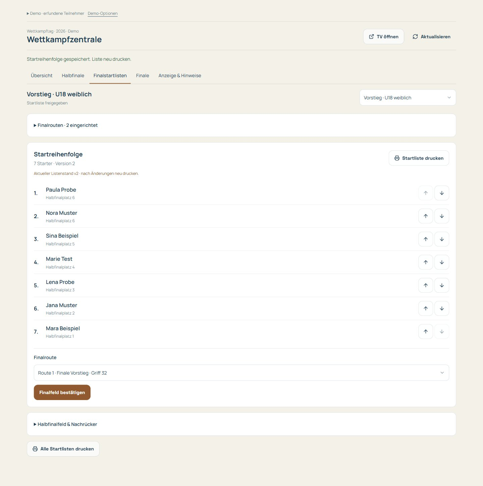

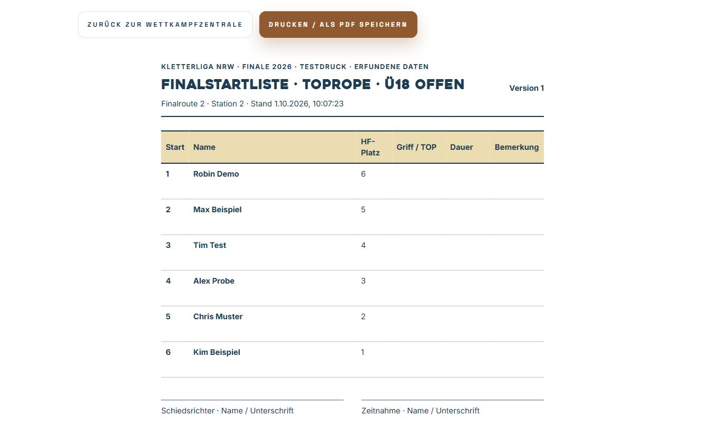

## 3. Klasse starten und digital erfassen

In **Finale** aktuelle Startliste drucken und verteilen, dann **Klasse starten**. Erst danach ist die digitale Eingabe offen. Im aufklappbaren Bereich **Finalpasswort** legt René einmal ein gemeinsames Passwort für beide Handys fest (mindestens zwölf Zeichen). Ein neues Passwort ersetzt das alte auf beiden Handys.

Die Zeitnehmenden öffnen die **Finaleingabe**, wählen einmal **Handy 1** beziehungsweise **Handy 2** und geben dasselbe Finalpasswort ein. Beide sehen alle freigegebenen Klassen. Die Handynummer dient nur dem Protokoll. **Klasse antippen → Teilnehmer antippen → Griff oder TOP und Minuten/Sekunden eintragen → Eintrag prüfen → Ergebnis speichern.** Die Prüfung zeigt Name, Klasse, Route, Startposition und Werte. Nach dem Speichern bleibt die Teilnehmerliste derselben Klasse offen; das Ergebnis steht direkt beim Namen.

Im lokalen Probedurchlauf **Finaleingabe öffnen**; das synthetische Demo-Finalpasswort steht unter **Demo-Optionen**. Dieser Link erscheint nicht in der Halbfinalansicht. Eine laufende Klasse wählen und beispielsweise **Griff 24 · 3 Minuten · 12 Sekunden** eintragen. **Eintrag prüfen**, Werte mit dem Papier vergleichen, **Ergebnis speichern**. Es gibt keine automatische Übernahme einer Browser-Stoppuhr.

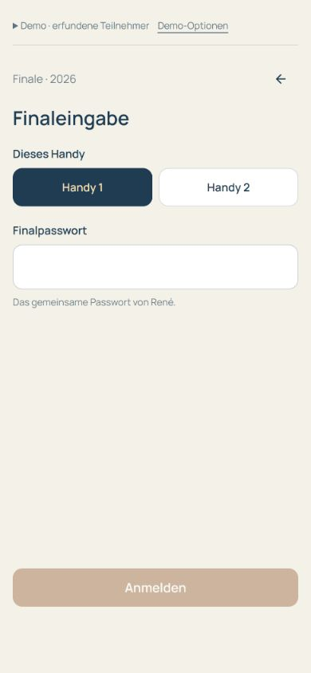

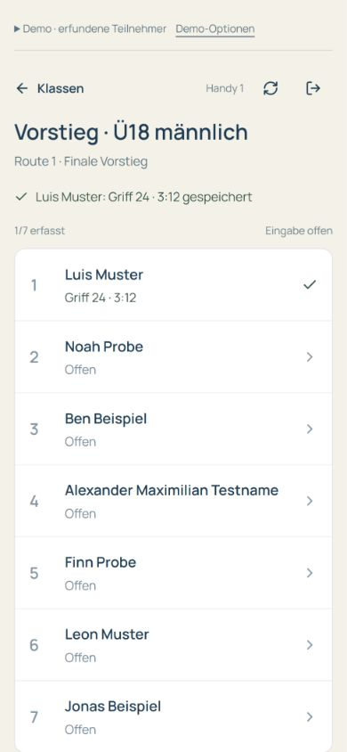

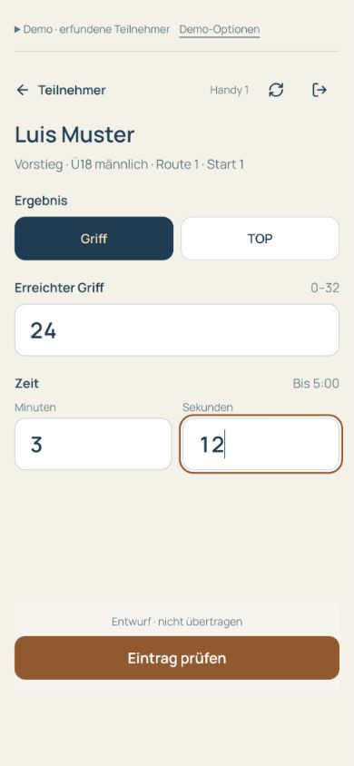

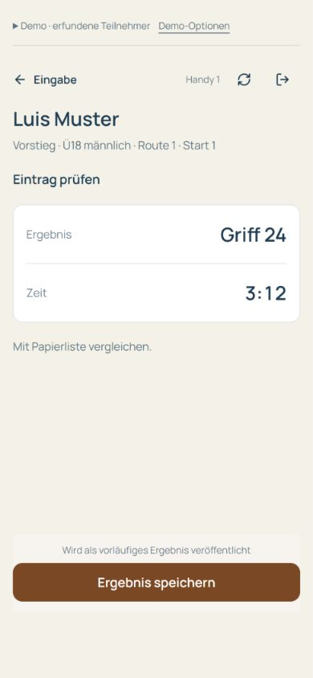

Eine bereits gespeicherte Person antippen, um den Wert zu korrigieren. Die vorhandenen Werte sind ausgefüllt; zusätzlich ist ein **Grund für die Korrektur** erforderlich. Zurückgehen erhält den Entwurf. Beim Wechsel zu einer anderen Person fragt die App vor dem Verwerfen bearbeiteter Werte. Bei einem inzwischen geänderten Klassenstand aktuellen Wert und Entwurf vergleichen, **Aktuellen Stand übernehmen** und erneut prüfen. Offline oder ohne Speicherbestätigung bleibt der Entwurf lokal; nach Wiederverbindung bewusst erneut senden. Ein bestätigtes Speichern bleibt erfolgreich, wenn lediglich der anschließende Listenabruf ausfällt.

## 4. Papierabgleich und Ergebnisfreigabe

René sieht gespeicherte Ergebnisse sofort in **Finale**. Jeden Wert mit dem Papier vergleichen und abgleichen. Nach dem letzten Start **Eingabe schließen**. **Endgültig freigeben** wird erst aktiv, wenn alle Starter ein geprüftes Ergebnis oder einen geklärten Ausfall haben. Technische Zwischenfälle müssen zuerst entschieden werden. Korrekturen brauchen eine Begründung; nach Freigabe zunächst begründet wieder öffnen und anschließend erneut prüfen.

Die Teilnehmer-Rangliste öffnet bei bestätigten Finaldaten direkt das **Finale**. Über den Klassenwähler wechselt man zwischen den Klassen; **Halbfinale** bleibt separat erreichbar. Rang, Startposition und Halbfinalplatz sind klar getrennt.

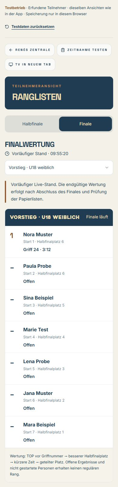

## 5. TV läuft automatisch

Im echten Betrieb öffnet der TV-Browser **`/live/2026` ohne Anmeldung**. René steuert den Bildschirm unter **Anzeige & Hinweise**. Halbfinale oder Finale wählen, gewünschte Klassen auswählen, Wechselintervall einstellen und **Anzeige speichern**. **Alle Klassen automatisch** nimmt alle Klassen auf. Alternativ eine Klasse fixieren.

Der TV zeigt acht Personen pro Seite. Er zeigt zuerst alle Seiten einer Klasse, dann die nächste Klasse. Die Klassen sind unten sichtbar. Standard: Wechsel alle 15 Sekunden, neue Werte alle fünf Sekunden. Auf dem TV stehen keine Verwaltungsbuttons. Bei Verbindungsproblemen bleibt der letzte Stand sichtbar und erhält eine Warnung.

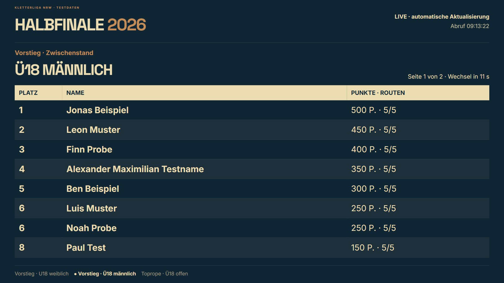

Hinweise erhalten Titel, Text, Ziel App/TV/beide und eine Anzeigedauer. Ein Vollbildhinweis pausiert die Rangliste. Nach Ablauf oder Rücknahme verschwindet er und die Rangliste läuft automatisch weiter. **Bis zur Rücknahme** bleibt dauerhaft sichtbar; für Zeitänderungen eine passende Dauer wählen. **TV öffnen** zeigt genau die Bildschirmansicht in einem separaten Tab.

## Zugänge und Ausfallverfahren

| Person/Gerät       | Echte Adresse                 | Zugang                                                     |
| ------------------ | ----------------------------- | ---------------------------------------------------------- |
| René               | `/app/admin/league/wettkampf` | Persönliches Liga-Admin-Konto                              |
| Beide Final-Handys | `/app/schiedsrichter/finale`  | Gemeinsames Finalpasswort, alle freigegebenen Finalklassen |
| Teilnehmer         | `/app/wettkampf/rangliste`    | Bestehender App-Zugang                                     |
| Fernseher          | `/live/2026`                  | Öffentlich, keine Anmeldung                                |

Bei Netzausfall auf Papier weiterarbeiten. Nach Wiederverbindung aktuellen Stand prüfen und den lokal erhaltenen Entwurf bewusst erneut senden. Eine unbestätigte Übertragung ist kein veröffentlichtes Ergebnis.

**Vor dem echten Event noch erforderlich:** Supabase-Anbindung, alle fünf Wettkampfmigrationen einschließlich gemeinsamer Passwortanmeldung und vereinfachter Admin-Nachträge, SQL-Tests in isolierter Datenbank, Renés tatsächliches Konto, Einrichtung des echten Finalpassworts durch René und ein vollständiger Durchlauf mit zwei Geräten sowie echtem TV und Drucker. Die lokale Probe bestätigt die Bedienung, nicht produktive Datenbankrechte. Ausführlicher Ablauf: [Bedienung am Wettkampftag](finale-wettkampfzentrale-2026.md); vereinbarte Halbfinalregeln: [Halbfinale](halbfinale-bedienkonzept.md).
