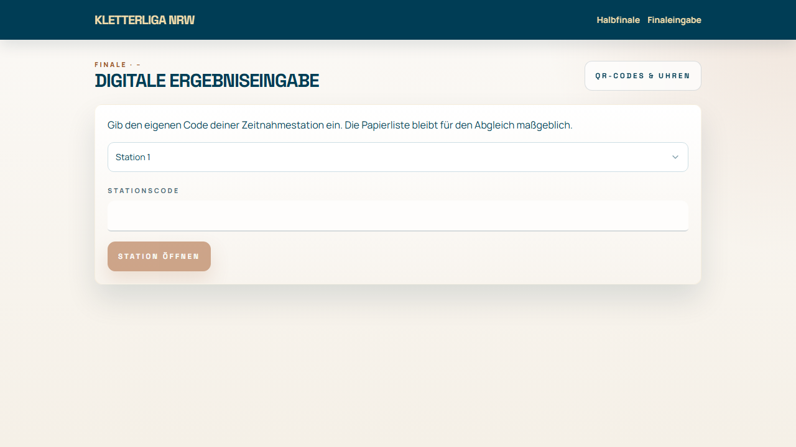
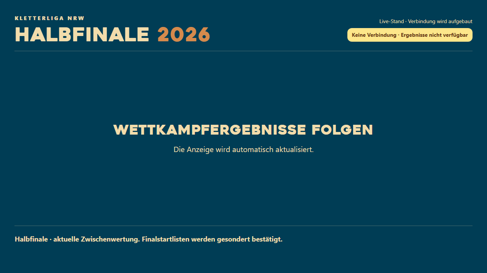

# Kurzanleitung · Halbfinale und Finale 2026

**Für René, Zeitnahme und TV-Betreuung.** Stand: 30. September 2026. Die Bilder stammen aus der lokal gestarteten App. Da die lokale Supabase-Anbindung und die Finalmigration noch fehlen, zeigen sie keine echten Wettkampfdaten. Die Schritte beschreiben den vorgesehenen Ablauf; der Probedurchlauf steht noch aus.

## 1. René: Wettkampfzentrale öffnen

Mit dem persönlichen Liga-Admin-Konto anmelden und `/app/admin/league/wettkampf` öffnen. Die fünf Reiter heißen **Übersicht**, **Halbfinale**, **Finalstartlisten**, **Finale** und **Anzeige & Hinweise**. Auf der Übersicht zuerst offene Halbfinaleinträge, ungeprüfte Finalergebnisse und letzte Änderungen kontrollieren.

## 2. Halbfinale abschließen und Startlisten freigeben

1. Halbfinaleingabe schließen. Bei jeder Klasse fehlende Routenergebnisse anhand der Papierunterlagen nachtragen oder begründet **„Nicht geklettert · 0 P.“** festhalten.
2. Im Reiter **Finalstartlisten** Ausfälle kennzeichnen. Das vorgeschlagene Finalfeld umfasst sechs Personen plus alle Punktgleichen an der Grenze. Bei Ausfällen vor Klassenstart Nachrücker prüfen.
3. Finalroute, letzte Griffnummer und Eingabestation je Klasse wählen; **Finalfeld bestätigen**. Die Startreihenfolge läuft vom letzten qualifizierten Halbfinalplatz zum ersten. Bei Bedarf die Reihenfolge ändern.
4. Aktuelle Liste drucken und die **Versionsnummer** prüfen. Nach jeder Änderung steht **„Neu drucken“**; alte Ausdrucke ersetzen.

## 3. Zeitnahme: Ergebnis digital übernehmen

Die beiden Zeitnehmenden öffnen `/app/schiedsrichter/finale`, wählen ihre jeweilige Station und geben den getrennten Stationscode ein. Der Code wird von René in der Zentrale erzeugt und kann dort ersetzt werden.

Danach **Klasse → Person → Griff oder TOP → Minuten und Sekunden → Eintrag prüfen → Jetzt speichern**. Die Zeit wird von der Stoppuhr beziehungsweise Papierliste übernommen. Erst die Speicherbestätigung bedeutet, dass der vorläufige Live-Stand aktualisiert wurde. Für jede Korrektur ist eine Begründung nötig.

Bei Verbindungsabbruch auf Papier weitermachen. Der lokale Entwurf ist **nicht übertragen**; nach Wiederverbindung zuerst den gespeicherten Stand prüfen und ihn bewusst erneut senden.

## 4. René: Papierabgleich und Freigabe

Im Reiter **Finale** je Klasse die Eingabe schließen, jeden Eintrag mit der Papierliste vergleichen und als abgeglichen markieren. Offene Ergebnisse, DNS und technische Zwischenfälle ausdrücklich klären. Erst dann **Endgültig freigeben**. Ergebnisliste und CSV sind bis dahin als **vorläufig** gekennzeichnet.

## 5. TV und Hinweise

Am Fernseher einmal `/live/2026` im Browser öffnen. Im Reiter **Anzeige & Hinweise** legt René Halbfinale oder Finale, Klassenrotation, Wechselintervall und bei Bedarf eine feste Klasse fest. Hinweise können für App, TV oder beide veröffentlicht und später zurückgezogen werden.

**Wichtig zum Bild:** Die gelbe Warnung entsteht hier durch die fehlende lokale Datenbankkonfiguration. Beim produktiven Test müssen Klassen und Ergebnisse erscheinen. Wenn während des Events die Verbindung abbricht, bleibt der letzte erfolgreiche Stand sichtbar und wird als veraltet markiert.

Die ausführlichere Ablauf- und Ausfallanleitung steht in [finale-wettkampfzentrale-2026.md](finale-wettkampfzentrale-2026.md). Screenshots der befüllten Admin-Zentrale und Ergebniseingabe werden nach der Datenbankprobe ergänzt.
