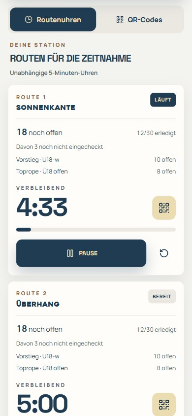
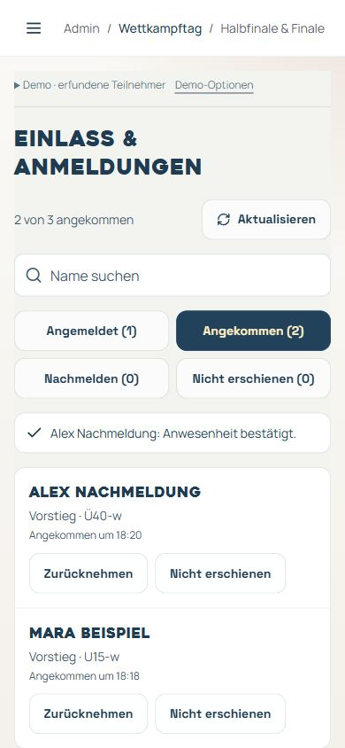
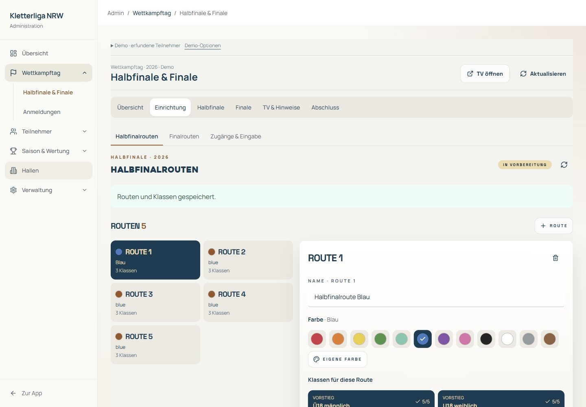
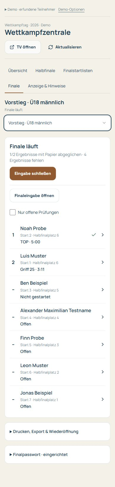
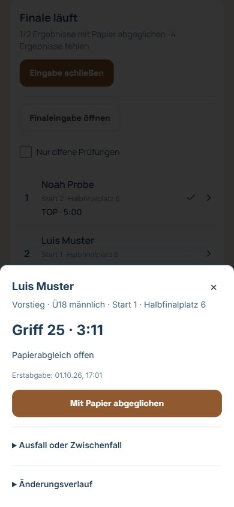
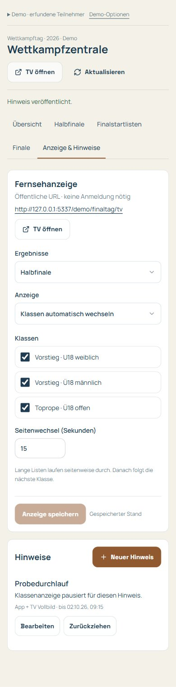
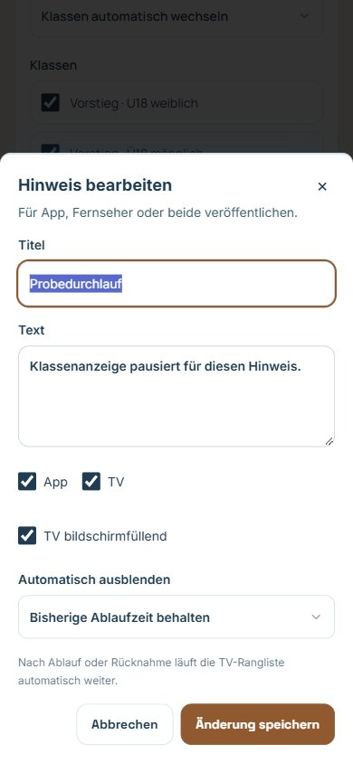

# Finaltag · Kurzanleitung für René und die Zeitnahme

## Schiedsrichter: Teilnehmerstand je Route · 3. Oktober 2026

Unter **/app/schiedsrichter** zeigt jede Routenuhr die zugeordneten Klassen, die Zahl der **noch offenen** Ergebnisse und den Fortschritt **erledigt/gesamt**. Dieselben Angaben stehen bei den QR-Codes. Der Stand aktualisiert sich alle zehn Sekunden; laufende Uhren bleiben erhalten.

**Noch offen** meint zugelassene, angemeldete Teilnehmer ohne bestätigtes Ergebnis an dieser Route, keine Warteschlange. Noch nicht eingecheckte Personen werden zusätzlich ausgewiesen. Auch bestätigte 0 Punkte und ausdrücklich geklärte Nichtversuche zählen als erledigt. Abgemeldete, nicht erschienene oder zurückgezogene Personen zählen nicht mit. Bei Verbindungsproblemen bleibt der letzte Stand mit **Stand veraltet** sichtbar.

## Teilnehmeransicht · 2. Oktober 2026

Unter **Halbfinale** stehen Klasse, Eingabestatus, eingetragene Ergebnisse und Abgabezeit kompakt über den fünf Routen. Die Aufforderung zum Einlass erscheint nur bis zur Bestätigung durch die Crew. Auch ein gespeichertes Ergebnis mit 0 Punkten zählt beim Fortschritt mit; fehlende Einträge bleiben offen.

Die Anleitung öffnet man bei Bedarf unter den Routen über **Hilfe zum Halbfinale**. Es gibt keinen automatisch geöffneten Begrüßungsdialog. Den kurzen QR-Tipp kann man mit **×** ausblenden; das merkt sich dieser Browser je Teilnehmer und Saison. Nach dem ersten Ergebnis verschwindet er ebenfalls. Verbindungsfehler und notwendige Einlassinformationen bleiben sichtbar.

Die lokale Vorschau unter **/demo/finaltag/teilnehmer** verwendet die tatsächliche Teilnehmerseite mit erfundenen Daten und speichert keine echten Ergebnisse. Sie ist im Produktionsbuild nicht enthalten.

## Einlass und Nachmeldungen · 2. Oktober 2026

Im Adminmenü **Wettkampftag → Einlass & Anmeldungen** öffnen. Unter **Angemeldet** die Person suchen und **Einchecken** antippen. Erst danach kann sie Halbfinalergebnisse nach dem Schiedsrichter-QR absenden. Eine Anmeldung allein bestätigt keine Anwesenheit. Die Teilnehmeransicht aktualisiert sich automatisch.

Unter **Nachmelden** stehen bestehende, aktivierte und zugelassene Liga-Teilnehmer ohne Eventanmeldung. **Nachmelden** öffnet die Prüfung von Name und Klasse; **Nachmelden & einchecken** meldet die Person an und bestätigt ihre Anwesenheit. Das benötigt fünf eingestellte Klassenrouten und ist nur vor 16 Uhr und vor Veröffentlichung der Finalklasse möglich. Neue Konten ohne Liga-Freigabe erhalten dadurch keine Startberechtigung.

René kann ohne vorhandene Halbfinalergebnisse eine Anwesenheit begründet zurücknehmen oder **Nicht erschienen** dokumentieren. Nicht-Erschienene bleiben in der Einlassverwaltung sichtbar; sie erhalten keinen regulären öffentlichen Halbfinalrang und blockieren die Finalfreigabe nicht. Fehlende Einträge anwesender Teilnehmer bleiben weiterhin offen.

Die Crew öffnet **/app/schiedsrichter/einlass** ohne persönliches Konto. René richtet dafür unter **Halbfinale & Finale → Einrichtung → Zugänge & Eingabe → Einlasspasswort** einen eigenen gemeinsamen Zugang ein. Er gilt ausschließlich für Einchecken und Nachmelden. **Zugang deaktivieren** widerruft ihn; ein neues Passwort ersetzt das bisherige. Passwörter werden hier nicht dokumentiert.

Bei Verbindungsfehlern gilt eine Aktion erst nach bestätigter Speicherung als erledigt. Den offenen Vorgang bewusst erneut senden. Nach einer Änderung durch ein anderes Gerät zuerst aktualisieren und den neuen Stand prüfen. Bei Ausfall Anwesenheit und Nachmeldungen auf Papier notieren; René gleicht sie vor digitalen Abgaben ab.

## Neue Navigation · 2. Oktober 2026

Im Adminmenü **Wettkampftag → Halbfinale & Finale** öffnen. Dort gilt jetzt:

- **Einrichtung → Halbfinalrouten:** Routen und Klassenzuordnung vorbereiten und speichern.
- **Einrichtung → Finalrouten:** Namen und letzte Griffnummer anlegen. Die Klassen werden erst unter **Finale → Finalstartlisten** zugeordnet.
- **Einrichtung → Zugänge & Eingabe:** Halbfinalzugang, Öffnen und Schließen der Halbfinaleingabe sowie das gemeinsame Finalpasswort.
- **Halbfinale:** Rangliste, fehlende Einträge und Korrekturen direkt beim Teilnehmer.
- **Finale → Finalstartlisten / Finalergebnisse:** Finalfeld und Drucklisten beziehungsweise Erfassungskontrolle und Papierabgleich.
- **TV & Hinweise:** Öffentliche Bildschirmansicht und Mitteilungen steuern.
- **Abschluss:** Urkunden der bisherigen Halbfinalwertung. Die finale Ergebnisliste wird weiterhin unter **Finalergebnisse** gedruckt oder exportiert.

Die folgenden älteren Screenshots zeigen den Ablauf; Menüpositionen wurden wie oben beschrieben gebündelt.

Die Bilder zeigen die überarbeiteten **App-Oberflächen mit erfundenen Testdaten**. [Lokal ausprobieren](http://127.0.0.1:5337/demo/finaltag), solange der Entwicklungsserver läuft. Die Testdaten bleiben im Browser. **Testdaten zurücksetzen** stellt drei Klassen wieder her: Vorstieg U18 hat eine freigegebene Startliste, Vorstieg Ü18 läuft bereits und Toprope hat eine offene Halbfinalroute.

## 1. Über die Übersicht einsteigen

Die Übersicht zeigt je Klasse Status und nächste Aktion. **Die Klassenzeile antippen** öffnet die passende Ansicht. Im Halbfinale stehen Suche und Klassenfilter direkt über der Liste. In Finalstartlisten und Finale lässt sich oben die **Klasse bearbeiten** wechseln. Der Fernseher läuft unabhängig davon.

## 2. Halbfinale verfolgen und Startliste drucken

Schiedsrichter kontrollieren das Ergebnis und zeigen den Routen-QR. Nach Scan und **Ergebnis absenden** zählt der bestätigte Eintrag sofort. René sieht unter **Halbfinale** eine Rangliste mit Suche, Klassenfilter und **Offene Ergebnisse**. Ein Klick auf den Namen öffnet die fünf Routen. Für eine Korrektur **Ändern**, für einen fehlenden Wert **Eintragen** wählen; Griff und Begründung eingeben, dann **Speichern**. Das funktioniert während der offenen Eingabe und nach 16 Uhr. Er bestätigt diese Ergebnisse nicht erneut. **0 Punkte** ist ein eingetragenes Ergebnis, **Noch nicht eingetragen** bleibt offen. Teilnehmer prüfen ihre eigenen Einträge.

Am **3. Oktober 2026 um 16:00 Uhr** sperrt die normale Abgabe automatisch. René kann anschließend weiterhin im Teilnehmerdialog mit Begründung nachtragen oder ausdrücklich als nicht geklettert mit null Punkten klären. Unter **Demo-Optionen** startet **Halbfinale ausprobieren** diesen Ablauf neu. **16-Uhr-Sperre testen** simuliert das Fristende; Robins fünfte Toprope-Route ist offen.

Wenn die fehlenden Einträge geklärt sind: In **Finalstartlisten** Vorschlag prüfen, Finalroute auswählen und **Finalfeld bestätigen**. Der Dialog nennt Klasse, Route und Starterzahl. Beide Final-Handys sehen alle freigegebenen Klassen. Sechs Plätze plus Punktgleiche; weniger verfügbare Personen ziehen vollständig ein.

In **Finalstartlisten** stehen die Starts zunächst vom schlechtesten qualifizierten Halbfinalplatz zum besten. Pfeile ändern ausschließlich die Startfolge. Unter **Halbfinalfeld & Nachrücker** Ausfälle vor Klassenstart begründet dokumentieren und das Feld erneut bestätigen. **Startliste drucken** öffnet einen separaten Tab. Nach Änderungen gilt die neue Version: alten Ausdruck ersetzen.

## 3. Klasse starten und digital erfassen

In **Finale → Finalergebnisse** aktuelle Startliste drucken und verteilen, dann **Klasse starten**. Erst danach ist die digitale Eingabe offen. Unter **Einrichtung → Zugänge & Eingabe → Finalpasswort** legt René einmal ein gemeinsames Passwort für beide Handys fest (mindestens zwölf Zeichen). Ein neues Passwort ersetzt das alte auf beiden Handys.

Die Zeitnehmenden öffnen die **Finaleingabe**, wählen einmal **Handy 1** beziehungsweise **Handy 2** und geben dasselbe Finalpasswort ein. Beide sehen alle freigegebenen Klassen. Die Handynummer dient nur dem Protokoll. **Klasse antippen → Teilnehmer antippen → Griff oder TOP und Minuten/Sekunden eintragen → Eintrag prüfen → Ergebnis speichern.** Die Prüfung zeigt Name, Klasse, Route, Startposition und Werte. Nach dem Speichern bleibt die Teilnehmerliste derselben Klasse offen; das Ergebnis steht direkt beim Namen.

Im lokalen Probedurchlauf **Finaleingabe öffnen**; das synthetische Demo-Finalpasswort steht unter **Demo-Optionen**. Dieser Link erscheint nicht in der Halbfinalansicht. Eine laufende Klasse wählen und beispielsweise **Griff 24 · 3 Minuten · 12 Sekunden** eintragen. **Eintrag prüfen**, Werte mit dem Papier vergleichen, **Ergebnis speichern**. Es gibt keine automatische Übernahme einer Browser-Stoppuhr.

Eine bereits gespeicherte Person antippen, um den Wert zu korrigieren. Die vorhandenen Werte sind ausgefüllt; zusätzlich ist ein **Grund für die Korrektur** erforderlich. Zurückgehen erhält den Entwurf. Beim Wechsel zu einer anderen Person fragt die App vor dem Verwerfen bearbeiteter Werte. Bei einem inzwischen geänderten Klassenstand aktuellen Wert und Entwurf vergleichen, **Aktuellen Stand übernehmen** und erneut prüfen. Offline oder ohne Speicherbestätigung bleibt der Entwurf lokal; nach Wiederverbindung bewusst erneut senden. Ein bestätigtes Speichern bleibt erfolgreich, wenn lediglich der anschließende Listenabruf ausfällt.

## 4. Papierabgleich und Ergebnisfreigabe

René sieht gespeicherte Ergebnisse sofort in **Finale**. **Person antippen → Wert mit Papier vergleichen → Mit Papier abgeglichen.** Unter **Ausfall oder Zwischenfall** einen Status mit Begründung speichern. **Nicht gestartet** erhält keinen regulären Ergebnisrang; offene Einträge bleiben offen. **Nur offene Prüfungen** reduziert die Liste auf noch zu klärende Personen.

Nach dem letzten Start **Eingabe schließen**. **Offiziell freigeben** wird erst aktiv, wenn alle Starter ein geprüftes Ergebnis oder einen geklärten Ausfall haben. Technische Zwischenfälle müssen zuerst entschieden werden. Unter **Drucken, Export & Wiederöffnung** stehen Ergebnisdruck, CSV und begründetes Wiederöffnen. Nach einer Korrektur erneut mit Papier abgleichen. Bei einem zwischenzeitlich geänderten Klassenstand zuerst **Aktuellen Stand übernehmen** und erneut prüfen.

Die Teilnehmer-Rangliste öffnet bei bestätigten Finaldaten direkt das **Finale**. Über den Klassenwähler wechselt man zwischen den Klassen; **Halbfinale** bleibt separat erreichbar. Rang, Startposition und Halbfinalplatz sind klar getrennt.

## 5. TV läuft automatisch

Im echten Betrieb öffnet der TV-Browser **`/live/2026` ohne Anmeldung**. René steuert den Bildschirm unter **TV & Hinweise**. Halbfinale oder Finale wählen, gewünschte Klassen auswählen, Wechselintervall einstellen und **Anzeige speichern**. **Klassen automatisch wechseln** rotiert über die angekreuzten Klassen. Alternativ eine Klasse fixieren. Bearbeitete Einstellungen bleiben beim Aktualisieren oder Ansichtswechsel erhalten.

Der TV zeigt acht Personen pro Seite. Er zeigt zuerst alle Seiten einer Klasse, dann die nächste Klasse. Die Klassen sind unten sichtbar. Standard: Wechsel alle 15 Sekunden, neue Werte alle fünf Sekunden. Auf dem TV stehen keine Verwaltungsbuttons. Bei Verbindungsproblemen bleibt der letzte Stand sichtbar und erhält eine Warnung.

**Neuer Hinweis** öffnet einen Dialog für Titel, Text, Ziel App/TV/beide und Anzeigedauer. Standardmäßig verschwindet der Hinweis nach zehn Minuten. Aktuelle Hinweise lassen sich bearbeiten oder **Zurückziehen**; abgelaufene Hinweise stehen separat. Ein Vollbildhinweis pausiert die Rangliste. Nach Ablauf oder Rücknahme verschwindet er und die Rangliste läuft automatisch weiter. **Bis zur Rücknahme** bleibt dauerhaft sichtbar; für Zeitänderungen eine passende Dauer wählen. **TV öffnen** zeigt genau die Bildschirmansicht in einem separaten Tab.

## Zugänge und Ausfallverfahren

| Person/Gerät       | Echte Adresse                 | Zugang                                                     |
| ------------------ | ----------------------------- | ---------------------------------------------------------- |
| René               | `/app/admin/league/wettkampf` | Persönliches Liga-Admin-Konto                              |
| Beide Final-Handys | `/app/schiedsrichter/finale`  | Gemeinsames Finalpasswort, alle freigegebenen Finalklassen |
| Teilnehmer         | `/app/wettkampf/rangliste`    | Bestehender App-Zugang                                     |
| Fernseher          | `/live/2026`                  | Öffentlich, keine Anmeldung                                |

Bei Netzausfall auf Papier weiterarbeiten. Nach Wiederverbindung aktuellen Stand prüfen und den lokal erhaltenen Entwurf bewusst erneut senden. Eine unbestätigte Übertragung ist kein veröffentlichtes Ergebnis.

**Stand 02.10.2026:** Supabase-Anbindung und alle fünf Wettkampfmigrationen sind produktiv eingerichtet; 50 SQL-Prüfungen und 369 Frontendtests bestehen. Renés persönliches Konto hat die geprüfte Liga-Admin-Berechtigung. Noch erforderlich: sein tatsächlicher Login, Einrichtung des gemeinsamen Finalpassworts und der echten Finalrouten im Adminbereich sowie der Gerätedurchlauf mit zwei Handys, TV und Drucker. Ausführlicher Ablauf: [Bedienung am Wettkampftag](finale-wettkampfzentrale-2026.md); vereinbarte Halbfinalregeln: [Halbfinale](halbfinale-bedienkonzept.md).
