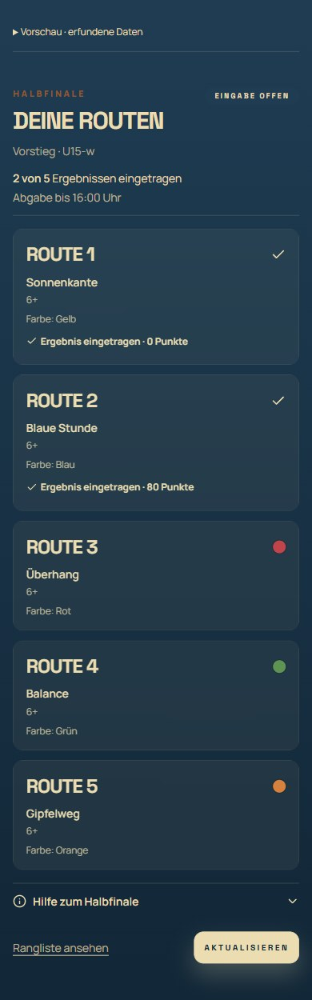

# Teilnehmerhinweise · 2. Oktober 2026

Die Halbfinalseite zeigt Klasse, Status, Fortschritt und die serverseitig konfigurierte Abgabezeit über den Routen. Der Einlasshinweis erscheint ausschließlich bis zur Crew-Bestätigung. Hilfe ist unter den Routen eingeklappt, ohne automatisch geöffneten Dialog. Ein optionaler QR-Tipp lässt sich ausblenden; gespeichert wird nur die Anzeigepräferenz je Profil/Saison/Version im Browser. Nach dem ersten Ergebnis entfällt der Tipp ebenfalls. Fehler und notwendige Einlassinformationen bleiben sichtbar.

Die Eingabelogik, QR-Prüfung, Check-in-Berechtigung, Frist, Entwürfe und Server-Schnittstellen bleiben erhalten. Die neue Vorschau `/demo/finaltag/teilnehmer` rendert die tatsächliche Teilnehmerseite mit synthetischer Datenquelle ausschließlich im Entwicklungsmodus; ihre Speicherung ist gesperrt und die Vorschau wird aus dem Produktionsbundle entfernt.

## Prüfung

- 425/425 Vitest-Tests erfolgreich, einschließlich Einlasswechsel ohne erneute Anmeldung, QR/Null-Ergebnis, Frist, Entwürfe und Verbindungsunterbrechung.
- Zusätzliche Prüfung: 0 zählt beim Fortschritt; Ergebnisse außerhalb der fünf zugeordneten Routen zählen nicht. Ausblenden bleibt je Profil und Saison erhalten, bei gesperrtem Speicher zumindest während der Sitzung.
- Produktionsbuild erfolgreich; keine synthetischen Profil-/Eventkennungen oder Vorschau-Steuerung im Bundle.
- Geänderte Dateien ohne ESLint-Fehler; drei bekannte Fast-Refresh-Warnungen in CompetitionDay.
- App-TypeScript-Prüfung weiterhin mit 15 bestehenden Fehlern in anderen Dateien; keine in den geänderten Komponenten.
- Tatsächlich gerenderte Teilnehmerseite mit synthetischen Daten bei 390 × 844, 768 × 1024 und 1440 × 900 geprüft. Kein horizontales Überlaufen. Einlasshinweis, Hilfe, dauerhaftes Ausblenden, gespeicherte 0, geschlossene Eingabe und Fehlerzustand kontrolliert.

Die vorhandene reale Browseranmeldung war abgelaufen. Ein erneuter Browserdurchlauf mit einem echten eingeloggten Teilnehmer wurde deshalb nicht durchgeführt. Es wurden keine realen Ergebnisse oder Konten verändert. Nächster Vor-Ort-Schritt: Teilnehmerseite nach erneuter Anmeldung aktualisieren und den tatsächlichen Einlasswechsel prüfen.
