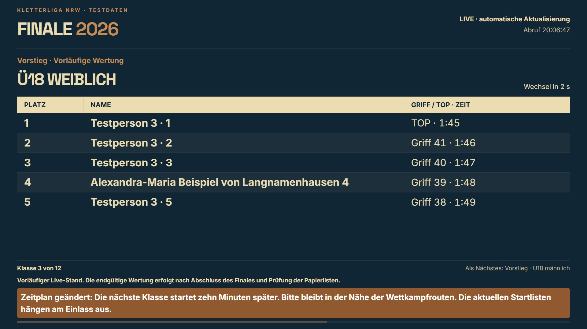

# TV-Anzeige ohne Maus · 02.10.2026

Der Fernseher öffnet https://www.kletterliga-nrw.de/live/2026 ohne Anmeldung. René wählt in der Wettkampfzentrale unter **Anzeige & Hinweise** Halbfinale oder Finale, die Klassen und das Wechselintervall. Standard: 15 Sekunden je Seite. Am TV ist anschließend keine Bedienung nötig.

- Jede Seite passt in die tatsächliche Browserhöhe. Die Anzeige berechnet anhand der verfügbaren Höhe, Tabellenüberschrift und längsten Zeile aller ausgewählten Klassen, wie viele Personen vollständig passen; maximal acht pro Seite.
- Alle Seiten einer Klasse erscheinen nacheinander, danach die nächste ausgewählte Klasse. Nach der letzten Klasse beginnt die Anzeige wieder vorn. Eine fixierte Klasse blättert ebenfalls automatisch durch ihre Seiten.
- Seiten- und Klassenwechsel werden über 550 ms sanft eingeblendet. Die Aktualisierung von Ergebnissen alle fünf Sekunden startet weder den Übergang noch die Rotation neu. Bei reduzierter Bewegung entfallen Animationen.
- Seitenzahl, verbleibende Zeit, Fortschrittsbalken und nächste Klasse geben Orientierung. Die Klassenübersicht benötigt auch bei zwölf Klassen keine zusätzlichen Bildschirmzeilen.
- Hinweise beanspruchen ihren tatsächlichen Platz; die Personenzahl passt sich an. Ein abgelaufener oder zurückgezogener Vollbildhinweis gibt die Rangliste automatisch wieder frei. Der vorläufige Finalhinweis bleibt sichtbar.
- Bei Verbindungsproblemen bleibt der letzte Stand sichtbar und als möglicherweise veraltet gekennzeichnet. Es gibt keine Schreibfunktionen oder Anmeldung auf der TV-Seite.

## Prüfung

424 Tests in 92 Dateien bestanden; darunter automatische Rotation, fixierte Klasse, lange Namen auf späteren Seiten, Größenänderung, Polling ohne erneute Animation und Hinweisablauf bei Netzausfall. Produktionsbuild und gezielter ESLint bestanden. App-Typecheck: dieselben 15 bekannten Fehler außerhalb der TV-Änderung.

Browserprüfung mit 82 erfundenen Personen und zwölf Klassen: 1920 × 1080, 1280 × 720, 960 × 540 und 390 × 844. Keine vertikalen oder horizontalen Dokumentüberläufe; letzte Tabellenzeile vor dem Fußbereich. Zusätzlich Hinweise mit maximal 500 Textzeichen, Vollbildhinweis mit langem Titel und reduzierte Bewegung geprüft.

Die synthetische Belastungsansicht ist ausschließlich lokal in der Entwicklungsdemo verfügbar: `/demo/finaltag/tv?belastung=1&phase=final`. Optionen `lang=1` und `hinweis=vollbild` prüfen lange Hinweise. Diese Daten und der Demo-Code sind nicht Teil des Produktionsbundles oder öffentlichen Endpunkts.

Ein tatsächlicher TV-Browser bleibt vor Ort zu prüfen: URL öffnen, Browser möglichst im Vollbild verwenden und mindestens einen vollständigen Klassenwechsel abwarten. Bildschirmschoner beziehungsweise automatische Abschaltung werden im Gerät eingestellt; eine Webseite kann deren Verhalten nicht zuverlässig steuern.
